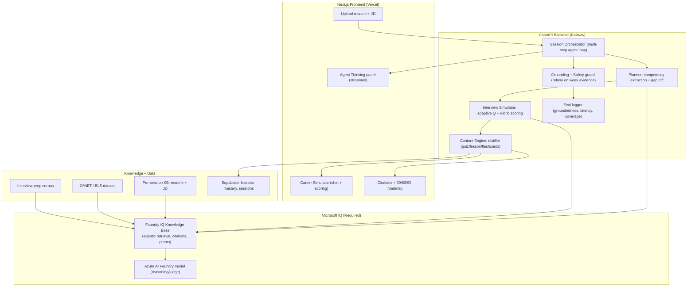

# PathWise → Battle #1: Creative Apps (GitHub Copilot) — Judge-Grade Improvement Plan

> **Author's framing:** This document is written as if I were both a *competition judge* scoring the rubric and a *lead data scientist* planning the build. It maps PathWise's current state to the rubric, finds every gap between "good" and "excellent," and specifies exactly **what to build, with what data, which agent/step, what architecture, and on what timeline**. No code here — this is the brief that the implementation follows.

---

## 0. TL;DR — Why this track, and the one-line pitch

- **Track fit:** PathWise is already a polished, live, full-stack product (Next.js + FastAPI, Groq + Cohere + Supabase). Creative Apps rewards **novel, demoable, AI-assisted experiences**. PathWise's PDF→learning→career pipeline is the single most *demoable* asset you own.
- **Pitch:** *"Drop in any PDF or paste a job posting — PathWise turns it into a personalized learning universe and a role-ready career cockpit in seconds."*
- **Required Microsoft IQ:** integrate **Foundry IQ** (managed, multi-source, citation-backed agentic retrieval in Microsoft Foundry) as the grounding layer behind the learning/chat experience. This is the cleanest IQ to bolt onto an existing RAG app and instantly upgrades your *Accuracy* and *Reliability* scores.

---

## 1. Current State (what the judge will actually see today)

| Capability | Status | Evidence in repo |
|---|---|---|
| PDF distillation → summary/quiz/flashcards/lessons/concept maps | ✅ Live | `backend/distiller.py`, `frontend/` quick actions |
| RAG chat over uploaded docs | ✅ Live | Cohere embeddings + Supabase pgvector |
| RIASEC career quiz + O*NET role matching + roadmaps | ✅ Live | `backend/resume_career.py` |
| Dashboard, mastery, progress tracking | ✅ Live | dashboard/mastery modules |
| Deployment | ✅ Vercel + Railway | `Procfile`, `render.yaml` |
| **Grounding with citations** | ⚠️ Partial | retrieval exists, but answers are not citation-first |
| **Agentic / multi-step reasoning** | ⚠️ Weak | mostly single-shot LLM calls + map-reduce summarize |
| **Microsoft IQ integration** | ❌ Missing | **required to submit** |
| **Safety / eval / guardrails** | ⚠️ Thin | no visible eval harness, hallucination guard, or refusal |
| **"Wow" creative moment** | ⚠️ Diffuse | many features, no single unforgettable demo beat |

**Judge's blunt read:** *"Capable, real product. But it looks like a competent SaaS, not a creative showcase. It under-sells its reasoning, has no Microsoft IQ, and the demo has no single jaw-drop moment."* Fixing those three is the whole game.

---

## 2. Rubric → Gap → Action (the scoring model)

| Rubric (weight) | Today | Target | The gap to close |
|---|---|---|---|
| Accuracy & Relevance (20%) | Good | **Excellent** | Citation-first answers grounded via **Foundry IQ**; eval harness proving it |
| Reasoning & Multi-step (20%) | Moderate | **Excellent** | A visible **planner→retrieve→generate→verify** agent loop, surfaced in the UI |
| Creativity & Originality (15%) | Good | **Excellent** | One signature mode: **"Career Simulator"** (live role-play + adaptive gap-closing) |
| UX & Presentation (15%) | Excellent-ish | **Excellent** | Streaming "agent thinking" panel, citations, polished 2-min demo script |
| Reliability & Safety (20%) | Thin | **Excellent** | Grounding guard, refusal on weak evidence, eval dashboard, graceful failover |
| Community vote (10%) | Strong | — | Fun, shareable Career Simulator clip + live link |

The rest of this document details each action.

---

## 3. The signature creative feature: **"Career Simulator"**

> This is the *originality* play. Everything else is hardening; this is the thing the judge remembers.

**Concept:** User uploads (a) their resume PDF and (b) a target job posting (PDF or pasted text). PathWise spins up an **adaptive interview + skill-gap simulation**:

1. **Parse & ground** both documents (resume + JD) into a per-session knowledge base.
2. **Plan** a role-readiness assessment: extract the JD's required competencies, map to O*NET, diff against resume.
3. **Simulate** a live, multi-turn interview where each answer is scored against grounded competency rubrics.
4. **Close the gap**: after the simulation, auto-generate targeted micro-lessons + quizzes for the user's *weakest* competencies — reusing the existing distiller.
5. **Roadmap**: produce a dated 30/60/90-day plan with citations to source material.

**Why it scores:** it chains *every* existing module (distill, RAG chat, quiz, career match, roadmap) into **one coherent multi-step agent story** — which simultaneously lifts Creativity, Reasoning, and UX. It's also inherently shareable (community vote).

### Data sources used
| Data | Source | Role |
|---|---|---|
| Resume | User upload (per-session) | Candidate competency profile |
| Job posting | User upload / paste | Target competency set |
| O*NET / BLS role dataset | Already bundled in `backend/data/` | Canonical role→skill mapping |
| Interview-prep KB | Your `interview_prep/` corpus | Grounded question bank + rubric evidence |
| Generated micro-lessons | Distiller output (Supabase) | Gap-closing content |

---

## 4. Target architecture (creative app + Foundry IQ + agent loop)



**Hybrid model strategy (keep it cheap + fast for the demo):**
- Keep **Groq llama-3.3-70b** as the low-latency *generation* model (your current speed advantage).
- Add **Azure AI Foundry model** as the *reasoning/judge* model behind Foundry IQ for grounded retrieval + the interview rubric scoring. This satisfies the **Microsoft IQ requirement** without ripping out your working stack.

---

## 5. The multi-step agent loop (what makes "Reasoning" excellent)

Today most calls are single-shot. Judges reward a **visible, inspectable loop**. Implement and *surface in the UI*:

```
PLAN → RETRIEVE (Foundry IQ) → GENERATE → VERIFY → (retry or finalize)
```

| Step | Agent role | Input | Output | Surfaced in UI? |
|---|---|---|---|---|
| 1. Plan | Decompose JD into competencies; diff vs resume | resume+JD | competency gap list | ✅ "Here's what I'll test you on" |
| 2. Retrieve | Foundry IQ agentic retrieval over KB+O*NET+interview corpus | competency | grounded evidence + citations | ✅ citation chips |
| 3. Generate | Produce next adaptive question / micro-lesson | evidence | question or lesson | ✅ streamed |
| 4. Verify | Judge model checks answer vs rubric; checks groundedness | answer+evidence | score + supported/unsupported | ✅ score bar |
| 5. Reflect | If weak evidence → refuse/clarify; if weak answer → remediate | verify result | retry or finalize | ✅ "I need more info" |

**This loop is the same shape as a reasoning agent** — which means the engineering is reusable if you later also enter the Reasoning track. Surfacing it (the "Agent Thinking" panel) is what converts hidden cleverness into *visible* rubric points for both Reasoning and UX.

---

## 6. Closing each rubric gap — concrete actions

### 6.1 Accuracy & Relevance (20%) → Excellent
- Route all retrieval through a **Foundry IQ knowledge base** (sources: per-session KB, O*NET, interview-prep corpus). Agentic retrieval decomposes queries and returns **citation-backed** answers.
- Make answers **citation-first**: every generated claim links to a source chunk. This is the single biggest perceived-accuracy upgrade.
- Build a small **golden eval set** (~30 resume/JD pairs) and report groundedness + answer-relevance scores in a demo-visible eval card.

### 6.2 Reasoning & Multi-step (20%) → Excellent
- Implement the §5 loop and **stream the plan/verify steps** to the UI.
- Add **adaptive difficulty**: each interview question depends on the prior answer's score (true multi-step dependency, not a fixed script).
- Log the full trace per session (plannable, replayable) — judges love a "show your work" trace.

### 6.3 Creativity & Originality (15%) → Excellent
- Ship **Career Simulator** (§3) as the headline mode.
- Add one delightful flourish: a **shareable "Readiness Report" card** (score, top 3 gaps, 30/60/90 plan) exportable as an image/PDF — fuels the community vote.

### 6.4 UX & Presentation (15%) → Excellent
- **Agent Thinking panel** with streamed steps + citation chips.
- Tight **2-minute demo script** (see §8). Pre-seed one resume + one JD so the live demo never stalls.
- Keep the existing dark/light, drag-drop, responsive polish — it's already a strength.

### 6.5 Reliability & Safety (20%) → Excellent
- **Grounding guard:** if Foundry IQ retrieval confidence is low, the agent *says so* and asks a clarifying question instead of hallucinating.
- **Refusal:** out-of-scope prompts (non-career, non-learning) are declined.
- **Failover:** dual-provider (Azure Foundry ↔ Groq) so a provider outage degrades gracefully — demo never dies.
- **Eval dashboard:** groundedness %, refusal correctness, p95 latency. Showing this *is* the reliability score.

---

## 7. "GitHub Copilot–built" narrative (track-specific, easy points)

The track is explicitly about **AI-assisted development with Copilot + VS Code**. Make this legible:
- Add a short **`COPILOT_NOTES.md`**: where Copilot accelerated you (Pydantic schemas, FastAPI route scaffolding, React components, test generation, the Foundry IQ client wiring).
- Drop a few `// Copilot-assisted` references or commit messages that tell the story.
- Mention it in the demo intro ("built end-to-end with Copilot in VS Code"). This is low-effort, on-rubric signal.

---

## 8. Demo script (2 minutes — what the judge watches)

1. **0:00** — "PathWise turns any document into a learning + career cockpit." Upload resume + paste a Data Scientist JD.
2. **0:20** — Agent Thinking panel streams the **plan** (competencies extracted, gaps found). Citation chips appear.
3. **0:45** — **Career Simulator** asks an adaptive question; user answers; score bar + grounded feedback appear; next question adapts to the weak area.
4. **1:20** — On a weak competency, PathWise auto-generates a **micro-lesson + 3-question quiz** (reusing distiller).
5. **1:40** — **Readiness Report**: score, top-3 gaps, **30/60/90 roadmap** with citations; one-click share card.
6. **1:55** — Flash the **eval card** (groundedness %, latency) → reliability close.

---

## 9. Timeline (assuming ~2-week sprint, 1–2 builders)

| Phase | Days | Deliverable | Rubric lifted |
|---|---|---|---|
| P0 — Foundry setup | 1–2 | Azure AI Foundry project, Foundry IQ KB over O*NET + interview corpus, model deployment | Accuracy, Reliability |
| P1 — Agent loop | 3–5 | Plan→retrieve→generate→verify orchestrator in FastAPI; trace logging | Reasoning |
| P2 — Career Simulator | 6–9 | Resume+JD ingestion, adaptive interview, rubric scoring, gap→lesson handoff | Creativity, Reasoning |
| P3 — UX surfacing | 10–11 | Agent Thinking panel, citation chips, Readiness Report share card | UX, Community |
| P4 — Safety + eval | 12–13 | Grounding guard, refusal, failover, eval dashboard, golden set | Reliability, Accuracy |
| P5 — Polish + demo | 14 | `COPILOT_NOTES.md`, seeded demo, 2-min script rehearsal | UX, Presentation |

**Critical path:** P0 → P1 → P2. If time is short, ship P0+P1+P2 + the eval card; defer the share-card flourish.

---

## 10. Risks & mitigations

| Risk | Mitigation |
|---|---|
| Foundry IQ setup eats time | Start P0 day 1; fall back to Azure AI Search index if Foundry IQ preview access lags |
| Latency from added reasoning model | Keep Groq for generation; use Foundry model only for retrieval/judge; cache per-session KB |
| Demo stalls on live upload | Pre-seed one resume + JD; have a recorded backup clip |
| Over-scoping features | Career Simulator is the only *new* feature; everything else reuses existing modules |

---

## 11. Definition of "Excellent" (acceptance checklist)

- [ ] Foundry IQ grounds retrieval; answers show citations.
- [ ] Visible plan→retrieve→generate→verify loop with adaptive difficulty.
- [ ] Career Simulator runs end-to-end: resume+JD → interview → gap lessons → roadmap.
- [ ] Grounding guard + refusal + provider failover demonstrably work.
- [ ] Eval card shows groundedness %, refusal correctness, p95 latency.
- [ ] 2-min demo rehearsed; `COPILOT_NOTES.md` present; live link works.

---
---

# PART B — IMPLEMENTATION HOW-TO (file-by-file)

> This part answers *"how do I actually build it?"*: which existing scripts to reuse, which to leave alone, exactly what to add/change, and **what "success" means for each step**. It is grounded in the real repo layout (`backend/`, `frontend/`). No timeline in days — steps are ordered by dependency; parallelize with AI tooling as you like.

## B0. What you ALREADY have (reuse, don't rebuild)

A pleasant surprise from the code audit: the Career Simulator is **half-built already**. Reuse these:

| Existing asset | File | Reuse for |
|---|---|---|
| PDF → text/chunks/embeddings | `backend/distiller.py` (`pdf_to_text`, `chunk_text`, `embed_chunks`) | Ingesting resume + JD |
| Content generation | `backend/distiller.py` (`map_reduce_summary`, `gen_flashcards_quiz`, `generate_concept_map`) | Gap-closing micro-lessons/quizzes |
| Chat RAG | `backend/distiller.py` (`process_chat_message`) | Conversational interview turns |
| KB RAG over corpus | `backend/rag_kb.py` (Cohere 384-dim + Supabase RPC `match_interview_prep`) | Grounding rubric/questions in your interview-prep corpus |
| **Interview endpoints (already exist!)** | `backend/main.py` → `/api/career/interview/start`, `/api/career/interview/answer` | The Simulator's skeleton — upgrade these instead of starting fresh |
| Resume parse + O*NET match | `backend/resume_career.py` (`parse_resume`, `_find_onet_row`, `build_career_plan`, `upgrade_from_pdf`) | JD/resume competency diff |
| Career storage | `backend/career_plan_storage.py`, `backend/unified_career_system.py` | Persisting simulator sessions |
| Frontend shell | `frontend/components/unified-ai-interface.tsx`, `frontend/app/career/page.tsx`, `frontend/lib/api.ts`, `frontend/app/api/[...path]/route.ts` (proxy) | Simulator UI + streaming |

**Leave alone (no change needed):** `dashboard.py`, `mastery.py`, `career_matcher.py`, all `frontend/components/ui/*`, auth, theme. Touching these adds risk for zero rubric gain.

## B1. Add the Microsoft IQ layer — Foundry IQ (REQUIRED, do first)

This is the gating requirement. Goal: route grounded retrieval through a **Foundry IQ knowledge base** instead of (or alongside) the raw Supabase RPC.

**Portal steps (Microsoft Foundry):**
1. Create a Foundry project (Azure AI Foundry portal). Deploy one chat/reasoning model (GPT-class or Claude in Foundry) — this becomes your *judge/reasoning* model.
2. Create a **Knowledge Base** (Foundry IQ). Add knowledge sources:
   - **Azure Blob / AI Search index** with your `interview_prep/*.md` corpus (the same content `rag_kb.py` already ingests).
   - Optionally upload the O*NET CSVs from `backend/data/` as a second source.
3. Set retrieval **reasoning effort** = *low* for the demo (balance latency/quality). Note the knowledge-base ID + endpoint + key.

**Code changes here:**
- New file `backend/foundry_iq.py`: a thin async client that calls the Foundry IQ / Azure AI Search knowledge-base query API and returns `{answer, citations[], chunks[]}`. Mirror the return shape of your existing `rag_kb.match_interview_prep` so it's a drop-in.
- New env vars in `.env` + `backend/schemas.py` config: `FOUNDRY_KB_ENDPOINT`, `FOUNDRY_KB_KEY`, `FOUNDRY_KB_ID`, `FOUNDRY_MODEL_DEPLOYMENT`.
- In `backend/rag_kb.py`: add a `retrieve(query)` wrapper that prefers `foundry_iq` when env is set, else falls back to the existing Supabase RPC. **This single indirection is your provider-failover story too.**

**Success = ** a query to `backend/foundry_iq.py` returns grounded chunks **with citation URIs**, and toggling `FOUNDRY_KB_ENDPOINT` off cleanly falls back to Supabase with no error.

## B2. Build the multi-step agent loop (Reasoning rubric)

Goal: replace single-shot calls with an inspectable `PLAN → RETRIEVE → GENERATE → VERIFY` loop, and stream it.

**Code changes:**
- New file `backend/career_simulator.py` containing one orchestrator class, e.g. `SimulatorSession`, with methods:
  - `plan(resume_text, jd_text)` → calls `resume_career.parse_resume` + `_find_onet_row`, diffs competencies → returns ordered `gap_list`. (Reuse, don't reinvent.)
  - `retrieve(competency)` → calls `foundry_iq.retrieve` (B1) → grounded evidence + citations.
  - `next_question(gap, prior_score)` → uses the Foundry reasoning model; **difficulty depends on `prior_score`** (this is the "multi-step dependency" judges look for).
  - `score_answer(answer, evidence)` → judge model returns `{score, supported: bool, missing_points[]}`.
  - `verify(score, evidence_conf)` → if evidence weak → `clarify`; if answer weak → queue remediation.
  - `remediate(weak_competency)` → calls `distiller.gen_flashcards_quiz` + `map_reduce_summary` to make a micro-lesson. (Reuse.)
  - `finalize()` → 30/60/90 roadmap via `resume_career.build_career_plan`.
- New endpoints in `backend/main.py` (mirror the existing interview ones):
  - `POST /api/simulator/start` (multipart: resume + jd) → returns `session_id` + `plan`.
  - `POST /api/simulator/answer` → returns score + next question + any remediation.
  - `GET  /api/simulator/stream/{session_id}` → **SSE** streaming the plan/retrieve/verify steps (this powers the "Agent Thinking" panel).
  - `GET  /api/simulator/report/{session_id}` → final readiness report.
- **Upgrade** (don't duplicate) the existing `/api/career/interview/*` handlers to delegate into `SimulatorSession` so old UI keeps working.

**Success = ** a full `start → answer×N → report` cycle runs server-side; each `answer` shows the next question adapting to the prior score; the SSE stream emits at least the `plan`, `retrieve`, `verify` events with citation data.

## B3. Surface the loop in the UI (UX + Creativity rubric)

**Code changes (frontend):**
- New route `frontend/app/simulator/page.tsx` — upload resume + paste JD, then the chat surface.
- New component `frontend/components/agent-thinking-panel.tsx` — subscribes to the SSE endpoint (use the existing proxy `app/api/[...path]/route.ts`), renders a live timeline: *Planning → Retrieving (citation chips) → Scoring*.
- New component `frontend/components/readiness-report.tsx` — score gauge, top-3 gaps, 30/60/90 timeline (reuse `components/roadmap-timeline.tsx`), and an **export-as-image/PDF** button (html-to-image or print CSS) → this is the shareable artifact for the community vote.
- Add API helpers in `frontend/lib/api.ts`: `startSimulator`, `answerSimulator`, `streamSimulator`, `getReport`.
- Add a nav entry in `frontend/components/navbar.tsx`.

**Success = ** judge uploads a resume + JD in the browser, watches the thinking panel stream with citation chips, completes 2–3 adaptive questions, and downloads a Readiness Report card.

## B4. Safety, guard, eval (Reliability rubric)

**Code changes:**
- In `backend/career_simulator.py`: a `_grounding_guard(evidence_conf, threshold=0.5)` — if confidence is low, the agent returns *"I don't have grounded material for this; let's add detail"* instead of fabricating. Also a scope check (reject non-career/non-learning uploads).
- New file `backend/eval_simulator.py`: load a small golden set (~30 resume/JD pairs under `backend/data/eval/`), run sessions, compute **groundedness** (judge-checks each answer cites supporting evidence), **refusal correctness**, **p95 latency**. Emit `eval_report.json`.
- New endpoint `GET /api/simulator/eval` to surface the latest report; render it as an **eval card** in `frontend/app/dashboard/page.tsx`.
- Failover already comes free from B1's `retrieve()` indirection (Foundry ↔ Supabase) + your existing Groq/Cohere dual-key pattern.

**Success = ** `eval_report.json` shows groundedness ≥ ~0.9 and refusal correctness = 100% on the golden set; the dashboard eval card renders real numbers; killing the Foundry endpoint mid-demo degrades gracefully.

## B5. Copilot narrative (track-specific easy points)

- Add `PathWise/COPILOT_NOTES.md`: bullet where Copilot accelerated each new file above (schemas, FastAPI routes, the SSE component, the Foundry client, the eval harness).
- Keep a couple of `# Copilot-assisted` markers / commit messages.

**Success = ** the doc exists and the demo intro can credibly say "built with GitHub Copilot in VS Code."

## B6. Build order (dependency, not days)

```
B1 (Foundry IQ)  ─►  B2 (agent loop)  ─►  B3 (UI)  ─►  B4 (safety+eval)  ─►  B5 (Copilot notes)
        └── B1 also unlocks the failover story used in B4
```
If time-boxed, the minimum "excellent-capable" cut is **B1 + B2 + B3 + the B4 eval card**. The Readiness-Report share-card and B5 are last.

## B7. New vs. changed vs. untouched (quick reference)

| Action | Files |
|---|---|
| **New** | `backend/foundry_iq.py`, `backend/career_simulator.py`, `backend/eval_simulator.py`, `frontend/app/simulator/page.tsx`, `frontend/components/agent-thinking-panel.tsx`, `frontend/components/readiness-report.tsx`, `PathWise/COPILOT_NOTES.md` |
| **Change (small)** | `backend/main.py` (add simulator endpoints; delegate interview endpoints), `backend/rag_kb.py` (add `retrieve()` indirection), `backend/schemas.py` (config + simulator models), `frontend/lib/api.ts`, `frontend/components/navbar.tsx`, `frontend/app/dashboard/page.tsx` (eval card) |
| **Untouched** | `distiller.py`*, `resume_career.py`*, `dashboard.py`, `mastery.py`, `career_matcher.py`, all `components/ui/*`, auth/theme (*called, not modified) |
