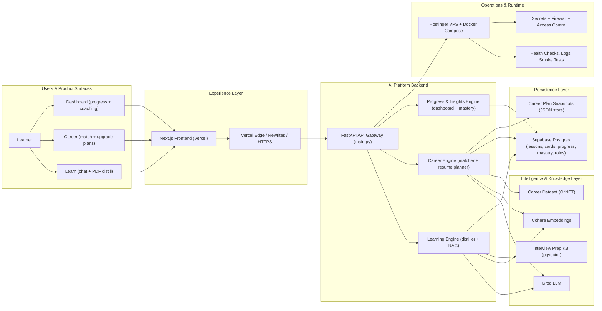

# PathWise

Monorepo for the PathWise / PathWise project.

- **Backend**: `backend/` (FastAPI)
- **Frontend**: `frontend/` (Next.js 14)

## Repository layout

- **`backend/`**: FastAPI service + Python modules + bundled JSON/CSV datasets under `backend/data/`
- **`frontend/`**: Next.js app (PathWise UI)
- **`backend/scripts/`**: offline / maintenance scripts (not imported by the API runtime)
- **Root deploy configs**: `Procfile`, `render.yaml`


## System Architecture (End-to-End)

The source-of-truth deep-dive (with sub-diagrams and migration details) is in `backend/ARCHITECTURE.md`.  
This section is the end-to-end product architecture view aligned with the current code in `backend/main.py`.

### High-level architecture (executive view)



**How to read this:** user actions start on the left (Learn/Career/Dashboard), flow through the web experience layer, then through the FastAPI platform into specialized AI/domain engines, which use models + knowledge + persistent storage, and finally run under managed VPS operations.

```mermaid
flowchart TB
    %% =======================
    %% EXPERIENCE LAYER
    %% =======================
    subgraph EXP["Experience Layer (Web + Product Surfaces)"]
      Web["Web Client (Next.js on Vercel)"]
      Auth["Supabase Auth Session"]
      LearnUI["Learn Surface<br/>chat · upload · quick actions"]
      CareerUI["Career Surface<br/>match · roadmap · resume upgrade"]
      DashUI["Dashboard Surface<br/>progress · analytics · coaching"]
      Web --> Auth
      Web --> LearnUI
      Web --> CareerUI
      Web --> DashUI
    end

    %% =======================
    %% DELIVERY / EDGE LAYER
    %% =======================
    subgraph EDGE["Delivery & Edge"]
      Vercel["Vercel Runtime / CDN"]
      Rewrites["Next rewrites/proxy<br/>same-origin /api/* and /health"]
      CORS["CORS + HTTPS boundary"]
      LearnUI --> Vercel
      CareerUI --> Vercel
      DashUI --> Vercel
      Vercel --> Rewrites
      Rewrites --> CORS
    end

    %% =======================
    %% API ORCHESTRATION LAYER
    %% =======================
    subgraph API["Application API Layer (FastAPI main.py)"]
      Health["Health + diagnostics<br/>/, /health, /api/test"]
      LearnAPI["Learn APIs<br/>/api/chat · /api/chat/upload · /api/distill<br/>/api/chat/ingest-distilled · preferences"]
      CareerAPI["Career APIs<br/>/api/career/match · /roadmap/* · /upgrade<br/>/resume/parse · /plan/build · /plan/snapshot"]
      DashAPI["Dashboard APIs<br/>/api/dashboard/*"]
      AgentAPI["Agent APIs<br/>/api/agent/mastery · /api/agent/diagnostic/results"]
      RecoAPI["Recommendation APIs<br/>/api/recommendations/* · /api/analytics/user/*"]
    end

    CORS --> Health
    CORS --> LearnAPI
    CORS --> CareerAPI
    CORS --> DashAPI
    CORS --> AgentAPI
    CORS --> RecoAPI

    %% =======================
    %% DOMAIN + INTELLIGENCE LAYER
    %% =======================
    subgraph DOM["Domain & Intelligence Layer (Python Modules)"]
      Distiller["distiller.py<br/>intent routing · prompt assembly · generation"]
      ConvState["conversation store/cache<br/>file_context + side-menu state"]
      RAG["rag_kb.py<br/>fallback retrieval when no PDF context"]
      Resume["resume_career.py<br/>resume extraction + upgrade plan synthesis"]
      Matcher["career_matcher.py<br/>RIASEC + embedding similarity over O*NET"]
      Unified["unified_career_system.py<br/>legacy/unified roadmap generator"]
      PlanStore["career_plan_storage.py<br/>latest plan snapshot persistence"]
      Dashboard["dashboard.py<br/>progress · achievements · recommendations"]
      Mastery["mastery.py<br/>diagnostic scoring + skill-level updates"]
      SHelper["supabase_helper.py<br/>typed persistence wrapper + graceful fallback"]
    end

    LearnAPI --> Distiller
    Distiller --> ConvState
    Distiller -. if no PDF context .-> RAG
    Distiller --> SHelper

    CareerAPI --> Resume
    CareerAPI --> Matcher
    CareerAPI --> Unified
    CareerAPI --> PlanStore
    Resume --> Matcher

    DashAPI --> Dashboard
    AgentAPI --> Mastery
    RecoAPI --> Dashboard
    Dashboard --> SHelper
    Mastery --> SHelper

    %% =======================
    %% DATA + MODEL LAYER
    %% =======================
    subgraph DATA["Data, Models & External Services"]
      Groq["Groq LLM<br/>structured generation"]
      Cohere["Cohere Embeddings<br/>semantic retrieval + similarity"]
      Supabase[(Supabase Postgres + pgvector)]
      KB[(interview_prep_kb<br/>chunked knowledge base)]
      Lessons[(lessons / lesson_metadata / concept_maps)]
      Progress[(lesson_completions / mastery / user_roles)]
      ONet[(backend/data/onet_bls_trimmed.csv)]
      PlanJSON[(backend/data/career_plans/*.json)]
    end

    Distiller --> Groq
    Distiller --> Cohere
    RAG --> Cohere
    RAG --> Supabase
    RAG --> KB
    Resume --> Groq
    Matcher --> Cohere
    Matcher --> ONet
    Unified --> ONet
    PlanStore --> PlanJSON
    SHelper --> Supabase
    Supabase --> Lessons
    Supabase --> Progress

    %% =======================
    %% OPERATIONS / RUNTIME LAYER
    %% =======================
    subgraph OPS["Runtime, Security & Operations"]
      Hostinger["Hostinger VPS (Docker)"]
      Compose["docker compose + restart policy"]
      FW["Firewall / Ports / Reverse Proxy"]
      Observability["Logs + health checks + smoke tests"]
      Secrets["Env & secret management<br/>GROQ/COHERE/SUPABASE keys"]
    end

    API --> Hostinger
    Hostinger --> Compose
    Hostinger --> FW
    Hostinger --> Observability
    Hostinger --> Secrets
    Secrets -. provides runtime config .-> API
```



### End-to-end behavior (detailed)

The single diagram above covers all paths; this section maps each product surface to concrete API and module responsibilities.

#### Learn surface (content generation loop)

- Frontend calls `/api/chat`, `/api/chat/upload`, and `/api/distill` from the Learn page.
- `main.py` delegates generation and retrieval orchestration to `distiller.py`.
- `distiller.py` uses:
  - conversation/PDF context when available;
  - `rag_kb.py` retrieval from `interview_prep_kb` when no PDF context is present;
  - Groq for structured generation;
  - Cohere for embeddings.
- Persisted learning artifacts (lesson rows, cards, concept maps, progress) are written through `supabase_helper.py` into Supabase.

#### Career surface (match + upgrade planning)

- Career endpoints in `main.py` fan out to two paths:
  - **matching/roadmap path** via `career_matcher.py` and `unified_career_system.py`;
  - **resume-driven upgrade path** via `resume_career.py` (`/resume/parse`, `/plan/build`, `/upgrade`).
- O*NET CSV (`backend/data/onet_bls_trimmed.csv`) is the grounding dataset for role matching and market-aligned plan enrichment.
- Latest plan snapshots are persisted by `career_plan_storage.py` under `backend/data/career_plans/*.json` for restore/reload UX.

#### Dashboard + mastery surface

- Dashboard endpoints (`/api/dashboard/*`) are served by `dashboard.py`, which reads persisted lesson/progress state via `supabase_helper.py`.
- Diagnostic result submissions (`/api/agent/diagnostic/results`) update mastery through `mastery.py`, persisted to Supabase via `supabase_helper.py`.
- Recommendations and analytics endpoints reuse dashboard/career persistence and scoring paths rather than introducing a separate storage system.

### Runtime boundaries and responsibilities

- **Frontend (`frontend/`)**: UX/state/rendering; no business logic truth.
- **API (`backend/main.py`)**: request validation, endpoint composition, response contracts.
- **Domain modules (`distiller.py`, `resume_career.py`, `career_matcher.py`, `dashboard.py`)**: core product logic.
- **Persistence wrappers (`supabase_helper.py`, `career_plan_storage.py`)**: durable state access.
- **AI providers**: Groq for generation, Cohere for embeddings.

### Contract checks (must stay true)

1. Learn quick actions route through `/api/chat` and return typed payloads.
2. Career resume planning uses `resume_career.py` + O*NET-backed matching.
3. Dashboard read paths remain stable even if Supabase is unavailable (graceful fallback behavior exists in helper layer).
4. `backend/ARCHITECTURE.md` is the low-level reference; this README section is the high-level end-to-end map.

## Deploy frontend (Vercel) — monorepo note

Your old PathWise repo likely had `package.json` at the **repository root**, so Vercel auto-detected Next.js.

This repo is a monorepo: Next.js lives in **`frontend/`**, so Vercel must be pointed there.

### Vercel project settings (required)

In **Vercel → Project → Settings → General**:

- **Root Directory**: `PathWise/frontend` (or `frontend` if your Git repo root is already `PathWise/`)
- **Framework Preset**: Next.js (auto)
- **Install Command**: `pnpm install --frozen-lockfile` (or leave default if you’re not using pnpm on Vercel)
- **Build Command**: `pnpm build` (or `next build`)

### Vercel environment variables (required)

- `NEXT_PUBLIC_SUPABASE_URL`
- `NEXT_PUBLIC_SUPABASE_ANON_KEY`
- `API_PROXY_TARGET` — Hostinger/VPS backend URL (e.g. `http://YOUR_VPS_IP:8000`). Next.js rewrites proxy `/api/*` and `/health` through Vercel so the browser avoids mixed-content blocks on HTTPS.
- `NEXT_PUBLIC_API_BASE_URL` — same backend URL for local dev; on Vercel with plain HTTP backend, leave unset or set to the HTTP URL (the frontend auto-falls back to same-origin proxy when on HTTPS).
- `NEXT_PUBLIC_SITE_URL` — optional; e.g. `https://pathwise001.vercel.app` (used for auth redirect hints during SSR).

**Supabase dashboard (Authentication → URL configuration):**

- Site URL: `https://pathwise001.vercel.app`
- Redirect URLs: `http://localhost:3000/auth/callback`, `https://pathwise001.vercel.app/auth/callback`

After changing Root Directory or env vars, trigger a **Redeploy**.

### What the main backend modules do (high level)

- **`backend/main.py`**: FastAPI app + HTTP routes
- **`backend/schemas.py`**: Pydantic request/response models
- **`backend/distiller.py`**: PDF ingestion, chunking, embeddings, “learn” chat tooling
- **`backend/study_agent.py`**: study/diagnostic agent orchestration
- **`backend/learn_tools.py`**: helpers for generating/ingesting learning artifacts
- **`backend/validators.py` / `backend/repairs.py`**: quality checks + repair passes for generated content
- **`backend/mastery.py`**: lightweight mastery tracking (Supabase-backed when configured)
- **`backend/supabase_helper.py`**: Supabase persistence helpers
- **`backend/career_matcher.py` / `backend/unified_career_system.py`**: career matching + roadmap logic
- **`backend/dashboard.py`**: dashboard-oriented recommendations/analytics glue
- **`backend/data/`**: static datasets used by career + dashboard features

---

## Backend (FastAPI)

A comprehensive backend system for AI-powered career guidance and personalized learning experiences. Built with FastAPI, featuring intelligent PDF processing, LLM-powered content generation, and sophisticated recommendation systems.

## 🏗️ Architecture Overview

### Core Components
- **FastAPI Application** (`backend/main.py`) - Main API server with comprehensive endpoints
- **Content Distiller** (`backend/distiller.py`) - PDF processing, LLM integration, and content generation
- **Career System** (`backend/unified_career_system.py`) - Career matching, roadmap generation, and skill analysis
- **Database Helper** (`backend/supabase_helper.py`) - Supabase integration for data persistence
- **Data Schemas** (`backend/schemas.py`) - Pydantic models for API contracts

### Technology Stack
- **Framework**: FastAPI (Python 3.9+)
- **LLM Provider**: Groq (llama-3.3-70b-versatile model)
- **Embeddings**: Cohere (text-embedding-ada-002)
- **Database**: Supabase (PostgreSQL)
- **Vector Search**: pgvector extension
- **Deployment**: VPS (Docker) / Render (`render.yaml`) / Heroku-style (`Procfile`)

### Run the backend locally

From `PathWise/backend/`:

```bash
python3 -m venv .venv
source .venv/bin/activate
pip install -r requirements.txt
uvicorn main:app --reload --host 127.0.0.1 --port 8000
```

Then open `http://127.0.0.1:8000/docs`.

### Deploy backend on Hostinger VPS (Docker)

Prereqs on the VPS: Docker + Docker Compose plugin (you already installed these if `docker compose version` works).

1. **Push this monorepo to GitHub** (the VPS will `git clone` what’s on GitHub, not your laptop folder).

2. **Open ports in Hostinger firewall**
   - **TCP 22** (SSH)
   - **TCP 8000** (quick test)
   - For a proper production setup with HTTPS, you’ll eventually want **TCP 80/443** too (reverse proxy).

3. **On the VPS**, clone and start the API:

```bash
mkdir -p /opt/pathwise && cd /opt/pathwise
git clone https://github.com/rahul370139/Backend_pathwise.git
cd Backend_pathwise/backend
```

4. Create `backend.env` next to `docker-compose.yml` (same folder as `backend/docker-compose.yml`):

```bash
cp backend.env.example backend.env
nano backend.env
chmod 600 backend.env
```

At minimum, include the keys your deployment uses (examples):

```env
GROQ_API_KEY=...
COHERE_API_KEY=...
NEXT_PUBLIC_SUPABASE_URL=...
NEXT_PUBLIC_SUPABASE_ANON_KEY=...
```

5. Build + run:

```bash
docker compose up -d --build
docker compose ps
docker logs -n 200 pathwise-backend
```

6. Smoke test from your laptop:

- `http://YOUR_VPS_IP:8000/health`
- `http://YOUR_VPS_IP:8000/docs`

#### Vercel note (important)

Vercel serves your frontend on **HTTPS**. Browsers often block calling a plain **`http://IP:8000`** API (mixed content). For production, put HTTPS in front of the API (for example **Nginx Proxy Manager** on Hostinger Docker Manager + Let’s Encrypt), then set:

- `NEXT_PUBLIC_API_BASE_URL=https://api.yourdomain.com`

## 🚀 Core Features

### 1. Learn Page - AI-Powered PDF Processing

#### PDF Upload & Processing (`/api/chat/upload`)
- **Chunking Strategy**: Intelligent text segmentation (500-800 chars) with overlap
- **Embedding Generation**: Cohere embeddings for semantic search
- **Content Analysis**: Automatic framework detection (Python, JavaScript, etc.)
- **Summary Generation**: LLM-powered bullet-point summaries
- **In-Memory Caching**: Stores processed content for session persistence

#### Content Generation Endpoints
- **Summary** (`/api/chat` + "create summary"): Key takeaways and insights
- **Quiz** (`/api/chat` + "generate quiz"): Interactive questions with multiple choice
- **Flashcards** (`/api/chat` + "create flashcards"): Front-back learning cards
- **Micro-lessons** (`/api/chat` + "create lesson"): Structured learning content
- **Workflows** (`/api/chat` + "create workflow"): Visual process diagrams (Mermaid)
- **Concept Maps** (`/api/chat` + "create concept map"): Knowledge graph visualization

#### Smart Content Generation
- **Retrieval-Augmented Generation (RAG)**: Uses relevant PDF chunks as context
- **Variable Item Counts**: Generate 5-20 quiz questions or flashcards on demand
- **Explanation Levels**: Intern, Junior, Senior, Expert content adaptation
- **Context-Aware**: Maintains conversation continuity across requests

### 2. Career Page - Intelligent Career Guidance

#### Career Matching System (`/api/career/match`)
- **Multi-Dimensional Analysis**: Skills, interests, experience level, goals
- **Skill Gap Analysis**: Identifies missing competencies for target roles
- **Personality Alignment**: Work style and cultural fit assessment
- **Market Demand**: Current industry trends and opportunities

#### Career Roadmap Generation (`/api/career/roadmap`)
- **Personalized Paths**: Custom learning journeys based on current state
- **Skill Progression**: Logical skill development sequences
- **Resource Recommendations**: Courses, projects, and certifications
- **Timeline Estimation**: Realistic milestones and deadlines

#### Skill Analysis & Recommendations
- **Technical Skills**: Programming languages, frameworks, tools
- **Soft Skills**: Communication, leadership, problem-solving
- **Domain Knowledge**: Industry-specific expertise areas
- **Learning Resources**: Curated content and practice materials

### 3. Dashboard - Unified Learning Management

#### Learning Progress Tracking
- **Session Management**: Conversation and lesson persistence
- **Content History**: Generated summaries, quizzes, and lessons
- **Skill Development**: Progress tracking across learning paths
- **Performance Analytics**: Quiz scores and learning metrics

#### Content Management
- **Lesson Organization**: Structured content hierarchy
- **Search & Discovery**: Semantic search across uploaded materials
- **Content Reuse**: Leverage previous generations for new requests
- **Export Capabilities**: Download generated content and roadmaps

## 🔧 Technical Implementation

### LLM Integration
- **Model**: Groq's llama-3.3-70b-versatile (optimized for quality)
- **Temperature**: 0.3 (strict JSON adherence)
- **Timeout**: 25 seconds with 2 retries
- **Prompt Engineering**: Structured prompts for consistent outputs
- **JSON Parsing**: Robust error handling for malformed responses

### Vector Search & Retrieval
- **Chunking**: Optimal text segmentation for context retrieval
- **Embedding Dimensions**: 1536-dimensional vectors (Cohere)
- **Similarity Search**: Cosine similarity for relevant content retrieval
- **Context Window**: Intelligent chunk selection for LLM context

### Caching Strategy
- **In-Memory Store**: Session-based content caching
- **Conversation Context**: Maintains file context across requests
- **Generated Content**: Caches LLM outputs to reduce API calls
- **User Sessions**: Persistent conversation tracking

### Error Handling & Fallbacks
- **Graceful Degradation**: Continues operation if Supabase fails
- **Fallback Content**: Pre-generated responses for common failures
- **Retry Logic**: Exponential backoff for transient errors
- **Logging**: Comprehensive error tracking and debugging

## 📡 API Endpoints

### Learn Page Endpoints
```
POST /api/chat/upload              # PDF upload and processing
POST /api/chat                     # Chat with AI (content generation)
GET  /api/chat/lesson/{id}/content # Retrieve lesson content
POST /api/chat/ingest-distilled    # Process extracted content
```

### Career Page Endpoints
```
POST /api/career/match             # Career matching analysis
POST /api/career/roadmap           # Generate career roadmap
GET  /api/career/skills            # Available skills list
POST /api/career/analyze           # Skills and experience analysis
```

### Dashboard Endpoints
```
GET  /api/dashboard/user/{id}      # User dashboard data
GET  /api/dashboard/lessons        # User's learning content
GET  /api/dashboard/progress       # Learning progress metrics
POST /api/dashboard/export         # Export learning data
```

## 🔄 Data Flow

### PDF Processing Pipeline
1. **Upload** → File validation and storage
2. **Chunking** → Text segmentation with overlap
3. **Embedding** → Vector generation for semantic search
4. **Analysis** → Framework detection and summary generation
5. **Caching** → Store processed content in memory
6. **Persistence** → Optional Supabase storage

### Content Generation Flow
1. **User Request** → Natural language command
2. **Context Retrieval** → Relevant PDF chunks via embeddings
3. **LLM Generation** → Structured content creation
4. **Response Formatting** → JSON payload with multiple formats
5. **Frontend Rendering** → Interactive content display

### Career Guidance Process
1. **Profile Input** → Skills, experience, goals
2. **Analysis Engine** → Multi-dimensional assessment
3. **Recommendation Engine** → Career path suggestions
4. **Roadmap Generation** → Personalized learning journey
5. **Resource Curation** → Learning materials and milestones

## 🎯 Key Features

### Intelligent Content Generation
- **Context-Aware**: Uses uploaded PDF content for relevant generation
- **Adaptive Difficulty**: Adjusts content complexity based on user level
- **Interactive Elements**: Quiz questions, flashcards, visual workflows
- **Multi-Format Output**: JSON, text, and structured data formats

### Career Intelligence
- **Market-Aware**: Current industry trends and demand
- **Skill Mapping**: Comprehensive skill taxonomy and relationships
- **Personalization**: User-specific recommendations and paths
- **Progress Tracking**: Learning milestones and achievements

### Performance Optimization
- **Async Processing**: Non-blocking API operations
- **Smart Caching**: Reduce redundant LLM calls
- **Batch Operations**: Efficient content processing
- **Connection Pooling**: Optimized database interactions

## 🔒 Security & Reliability

### Data Protection
- **User Isolation**: Strict user ID validation
- **Content Privacy**: User-specific content storage
- **API Rate Limiting**: Prevent abuse and ensure fairness
- **Input Validation**: Comprehensive request sanitization

### System Reliability
- **Graceful Degradation**: Continues operation during partial failures
- **Retry Mechanisms**: Automatic retry for transient errors
- **Health Monitoring**: System status and performance metrics
- **Backup Strategies**: Fallback content and error recovery

## 🚀 Deployment

### Environment Variables
```bash
GROQ_API_KEY=your_groq_api_key
COHERE_API_KEY=your_cohere_api_key
SUPABASE_URL=your_supabase_url
SUPABASE_KEY=your_supabase_key
```

## Frontend (Next.js)

See `frontend/README.md` for setup and environment variables.

### Railway Deployment
- **Automatic Scaling**: Based on traffic and load
- **Health Checks**: Continuous monitoring and restart
- **Log Aggregation**: Centralized logging and debugging
- **SSL Termination**: Automatic HTTPS configuration

## 📊 Monitoring & Debugging

### Logging Strategy
- **Structured Logging**: JSON-formatted log entries
- **Performance Metrics**: Response times and throughput
- **Error Tracking**: Detailed error context and stack traces
- **User Activity**: Request patterns and usage analytics

### Debug Endpoints
- **Health Check**: `/health` - System status
- **Metrics**: `/metrics` - Performance indicators
- **Debug Info**: `/debug` - Runtime information
- **Test Mode**: Fallback responses for development

## 🔮 Future Enhancements

### Planned Features
- **Multi-Language Support**: Internationalization and localization
- **Advanced Analytics**: Learning pattern analysis and insights
- **Collaborative Learning**: Group study and peer recommendations
- **Mobile Optimization**: Progressive web app capabilities
- **Integration APIs**: Third-party learning platform connections

### Technical Improvements
- **Vector Database**: Dedicated vector storage for better search
- **Model Fine-tuning**: Custom LLM training for domain expertise
- **Real-time Updates**: WebSocket support for live interactions
- **Microservices**: Modular architecture for scalability

---

*This backend powers the PathWise platform, providing intelligent career guidance and personalized learning experiences through advanced AI and machine learning technologies.*
