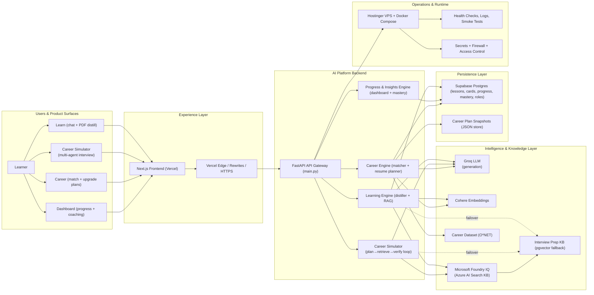

# PathWise

Monorepo for PathWise — an AI-powered learning and career-readiness platform built for the **Agents League · Creative Apps (GitHub Copilot)** track. Drop in a PDF or target job posting and PathWise turns it into personalized learning content, a grounded career cockpit, and a live **Career Simulator** interview.

- **Backend**: `backend/` (FastAPI on Hostinger VPS) — [backend/README.md](backend/README.md)
- **Frontend**: `frontend/` (Next.js 14 on Vercel) — [frontend/README.md](frontend/README.md)
- **Live frontend**: [pathwise-jade.vercel.app](https://pathwise-jade.vercel.app/)
- **Live backend**: [http://2.24.74.235:8000](http://2.24.74.235:8000/) (API docs at `/docs`)
- **Hackathon submission copy**: [docs/SUBMISSION.md](docs/SUBMISSION.md)
- **All documentation**: [docs/README.md](docs/README.md)

## Documentation

| Doc | Purpose |
|---|---|
| [docs/SUBMISSION.md](docs/SUBMISSION.md) | **Project page** — pitch, track, Foundry IQ, demo script |
| [docs/COPILOT_NOTES.md](docs/COPILOT_NOTES.md) | GitHub Copilot build narrative |
| [docs/COMPETITION.md](docs/COMPETITION.md) | Rubric mapping & implementation brief |
| [docs/backend/ARCHITECTURE.md](docs/backend/ARCHITECTURE.md) | Backend flows, endpoints, Foundry IQ |
| [docs/backend/STRUCTURE.md](docs/backend/STRUCTURE.md) | `pathwise/` package tree & CLI probes |

## Repository layout

- **`backend/pathwise/`**: Python package — `learn/`, `career/`, `dashboard/`, `infra/`, `eval/` (see [docs/backend/STRUCTURE.md](docs/backend/STRUCTURE.md))
- **`backend/`**: FastAPI service + `main.py` entry + datasets under `backend/data/`
- **`backend/knowledge_base/`**: Version-controlled grounding corpus (learning topics, behavioral prep, O*NET briefs) synced to **Foundry IQ**
- **`frontend/`**: Next.js app (PathWise UI)
- **`backend/scripts/`**: offline / maintenance scripts (`push_to_foundry.py`, `onet_to_markdown.py`, RAG ingest)
- **Root deploy configs**: `Procfile`, `render.yaml`


## System Architecture (End-to-End)

The source-of-truth deep-dive (with sub-diagrams and migration details) is in [docs/backend/ARCHITECTURE.md](docs/backend/ARCHITECTURE.md).  
This section is the end-to-end product architecture view aligned with the current code in `backend/main.py`.

### High-level architecture (executive view)



**How to read this:** user actions start on the left (Learn/Career/Dashboard), flow through the web experience layer, then through the FastAPI platform into specialized AI/domain engines, which use models + knowledge + persistent storage, and finally run under managed VPS operations.

```mermaid
flowchart TB
    %% =======================
    %% EXPERIENCE LAYER
    %% =======================
    subgraph EXP["Experience Layer (Web + Product Surfaces)"]
      Web["Web Client (Next.js on Vercel)"]
      Auth["Supabase Auth Session"]
      LearnUI["Learn Surface<br/>chat · upload · quick actions"]
      SimUI["Career Simulator<br/>resume+JD · agent timeline · readiness report"]
      CareerUI["Career Surface<br/>match · roadmap · resume upgrade"]
      DashUI["Dashboard Surface<br/>progress · analytics · eval card"]
      Web --> Auth
      Web --> LearnUI
      Web --> SimUI
      Web --> CareerUI
      Web --> DashUI
    end

    %% =======================
    %% DELIVERY / EDGE LAYER
    %% =======================
    subgraph EDGE["Delivery & Edge"]
      Vercel["Vercel Runtime / CDN"]
      Rewrites["Next rewrites/proxy<br/>same-origin /api/* and /health"]
      CORS["CORS + HTTPS boundary"]
      LearnUI --> Vercel
      SimUI --> Vercel
      CareerUI --> Vercel
      DashUI --> Vercel
      Vercel --> Rewrites
      Rewrites --> CORS
    end

    %% =======================
    %% API ORCHESTRATION LAYER
    %% =======================
    subgraph API["Application API Layer (FastAPI main.py)"]
      Health["Health + diagnostics<br/>/, /health, /api/test"]
      LearnAPI["Learn APIs<br/>/api/chat · /api/chat/upload · /api/distill<br/>/api/chat/ingest-distilled · preferences"]
      CareerAPI["Career APIs<br/>/api/career/match · /roadmap/* · /upgrade<br/>/resume/parse · /plan/build · /plan/snapshot"]
      DashAPI["Dashboard APIs<br/>/api/dashboard/*"]
      AgentAPI["Agent APIs<br/>/api/agent/mastery · /api/agent/diagnostic/results"]
      SimAPI["Simulator APIs<br/>/api/simulator/{start,answer,stream,report,eval}"]
      RecoAPI["Recommendation APIs<br/>/api/recommendations/* · /api/analytics/user/*"]
    end

    CORS --> Health
    CORS --> LearnAPI
    CORS --> CareerAPI
    CORS --> DashAPI
    CORS --> AgentAPI
    CORS --> SimAPI
    CORS --> RecoAPI

    %% =======================
    %% DOMAIN + INTELLIGENCE LAYER
    %% =======================
    subgraph DOM["Domain & Intelligence Layer (Python Modules)"]
      Distiller["distiller.py<br/>intent routing · prompt assembly · generation"]
      ConvState["conversation store/cache<br/>file_context + side-menu state"]
      RAG["rag_kb.py<br/>retrieve() → Foundry IQ or Supabase"]
      FIQmod["foundry_iq.py<br/>Microsoft Foundry IQ client"]
      SimOrch["career_simulator.py<br/>Planner · Retrieval · Interviewer · Scorer"]
      EvalSim["eval_simulator.py<br/>golden-set groundedness + latency"]
      Resume["resume_career.py<br/>resume extraction + upgrade plan synthesis"]
      Matcher["career_matcher.py<br/>RIASEC + embedding similarity over O*NET"]
      Unified["unified_career_system.py<br/>legacy/unified roadmap generator"]
      PlanStore["career_plan_storage.py<br/>latest plan snapshot persistence"]
      Dashboard["dashboard.py<br/>progress · achievements · recommendations"]
      Mastery["mastery.py<br/>diagnostic scoring + skill-level updates"]
      SHelper["supabase_helper.py<br/>typed persistence wrapper + graceful fallback"]
    end

    LearnAPI --> Distiller
    Distiller --> ConvState
    Distiller -. if no PDF context .-> RAG
    RAG --> FIQmod
    RAG -. failover .-> SHelper
    SimAPI --> SimOrch
    SimOrch --> Resume
    SimOrch --> RAG
    SimOrch --> Distiller
    EvalSim -. offline .-> SimOrch

    CareerAPI --> Resume
    CareerAPI --> Matcher
    CareerAPI --> Unified
    CareerAPI --> PlanStore
    Resume --> Matcher

    DashAPI --> Dashboard
    AgentAPI --> Mastery
    RecoAPI --> Dashboard
    Dashboard --> SHelper
    Mastery --> SHelper

    %% =======================
    %% DATA + MODEL LAYER
    %% =======================
    subgraph DATA["Data, Models & External Services"]
      Groq["Groq LLM<br/>structured generation"]
      Cohere["Cohere Embeddings<br/>semantic retrieval + similarity"]
      Foundry["Microsoft Foundry IQ<br/>Azure AI Search index (prepkb-index)"]
      Supabase[(Supabase Postgres + pgvector)]
      KB[(interview_prep_kb<br/>chunked knowledge base)]
      Lessons[(lessons / lesson_metadata / concept_maps)]
      Progress[(lesson_completions / mastery / user_roles)]
      ONet[(backend/data/onet_bls_trimmed.csv)]
      PlanJSON[(backend/data/career_plans/*.json)]
    end

    Distiller --> Groq
    Distiller --> Cohere
    RAG --> Cohere
    FIQmod --> Foundry
    Foundry -. indexes .-> KB
    RAG --> Supabase
    RAG --> KB
    Resume --> Groq
    Matcher --> Cohere
    Matcher --> ONet
    Unified --> ONet
    PlanStore --> PlanJSON
    SHelper --> Supabase
    Supabase --> Lessons
    Supabase --> Progress

    %% =======================
    %% OPERATIONS / RUNTIME LAYER
    %% =======================
    subgraph OPS["Runtime, Security & Operations"]
      Hostinger["Hostinger VPS (Docker)"]
      Compose["docker compose + restart policy"]
      FW["Firewall / Ports / Reverse Proxy"]
      Observability["Logs + health checks + smoke tests"]
      Secrets["Env & secret management<br/>GROQ/COHERE/SUPABASE keys"]
    end

    API --> Hostinger
    Hostinger --> Compose
    Hostinger --> FW
    Hostinger --> Observability
    Hostinger --> Secrets
    Secrets -. provides runtime config .-> API
```



### End-to-end behavior (detailed)

The single diagram above covers all paths; this section maps each product surface to concrete API and module responsibilities.

#### Career Simulator (signature Creative Apps feature)

- Frontend route: `/simulator` — upload resume + paste job description, then run a live multi-agent interview.
- Backend orchestrator: `career_simulator.py` runs an inspectable loop:
  **PLAN → RETRIEVE (Foundry IQ) → GENERATE (adaptive question) → VERIFY (rubric score) → REMEDIATE → FINALIZE (readiness report)**.
- APIs: `POST /api/simulator/start`, `POST /api/simulator/answer`, `GET /api/simulator/stream/{session_id}` (SSE agent timeline), `GET /api/simulator/report/{session_id}`, `GET /api/simulator/eval`.
- UI components: `agent-thinking-panel.tsx` (streamed steps + citation chips), `readiness-report.tsx` (30/60/90 plan + export).
- Grounding: `rag_kb.retrieve()` prefers **Microsoft Foundry IQ** (`foundry_iq.py` → Azure AI Search) and falls back to Supabase pgvector — the demo failover story.
- Reliability: `eval_simulator.py` produces `data/eval/simulator_eval_report.json`; the dashboard renders an eval card from `GET /api/simulator/eval`.

#### Learn surface (content generation loop)

- Frontend calls `/api/chat`, `/api/chat/upload`, and `/api/distill` from the Learn page.
- `main.py` delegates generation and retrieval orchestration to `distiller.py`.
- `distiller.py` uses:
  - conversation/PDF context when available;
  - `rag_kb.retrieve()` → **Foundry IQ** (citation-backed) with Supabase pgvector fallback when no PDF context is present;
  - Groq for structured generation;
  - Cohere for embeddings.
- Persisted learning artifacts (lesson rows, cards, concept maps, progress) are written through `supabase_helper.py` into Supabase.

#### Career surface (match + upgrade planning)

- Career endpoints in `main.py` fan out to two paths:
  - **matching/roadmap path** via `career_matcher.py` and `unified_career_system.py`;
  - **resume-driven upgrade path** via `resume_career.py` (`/resume/parse`, `/plan/build`, `/upgrade`).
- O*NET CSV (`backend/data/onet_bls_trimmed.csv`) is the grounding dataset for role matching and market-aligned plan enrichment.
- Latest plan snapshots are persisted by `career_plan_storage.py` under `backend/data/career_plans/*.json` for restore/reload UX.

#### Dashboard + mastery surface

- Dashboard endpoints (`/api/dashboard/*`) are served by `dashboard.py`, which reads persisted lesson/progress state via `supabase_helper.py`.
- Diagnostic result submissions (`/api/agent/diagnostic/results`) update mastery through `mastery.py`, persisted to Supabase via `supabase_helper.py`.
- Recommendations and analytics endpoints reuse dashboard/career persistence and scoring paths rather than introducing a separate storage system.

### Runtime boundaries and responsibilities

- **Frontend (`frontend/`)**: UX/state/rendering; no business logic truth.
- **API (`backend/main.py`)**: request validation, endpoint composition, response contracts.
- **Domain modules (`distiller.py`, `resume_career.py`, `career_matcher.py`, `dashboard.py`)**: core product logic.
- **Persistence wrappers (`supabase_helper.py`, `career_plan_storage.py`)**: durable state access.
- **AI providers**: Groq for fast generation; **Microsoft Foundry IQ** (Azure AI Search) for citation-first grounding; Cohere for embeddings; Supabase pgvector as retrieval failover.

### Contract checks (must stay true)

1. Learn quick actions route through `/api/chat` and return typed payloads.
2. Career resume planning uses `resume_career.py` + O*NET-backed matching.
3. Dashboard read paths remain stable even if Supabase is unavailable (graceful fallback behavior exists in helper layer).
4. [docs/backend/ARCHITECTURE.md](docs/backend/ARCHITECTURE.md) is the low-level reference; this README section is the high-level end-to-end map.
5. **Microsoft IQ**: Foundry IQ must be configured in production (`FOUNDRY_SEARCH_*` env vars); see `pathwise/infra/foundry_iq.py` and `backend/knowledge_base/README.md`. Debug retrieval source via `GET /api/rag/status` and `GET /api/rag/probe?q=...`.

## Competition readiness (Creative Apps track)

**One-line pitch:** *Drop in any PDF or paste a job posting — PathWise turns it into a personalized learning universe and a role-ready career cockpit in seconds.*

| Rubric area | How PathWise addresses it |
|---|---|
| **Accuracy & Relevance** | Foundry IQ citation-first retrieval; grounded quick actions on Learn; competency-specific queries in Simulator |
| **Reasoning & Multi-step** | Visible `PLAN → RETRIEVE → GENERATE → VERIFY` loop with SSE agent timeline |
| **Creativity & Originality** | **Career Simulator** — resume + JD → adaptive interview → gap lessons → 30/60/90 readiness report |
| **UX & Presentation** | Agent Thinking panel, citation chips, per-user dashboard, dark/light polish, live Vercel demo |
| **Reliability & Safety** | Grounding guard + scope refusal; Foundry ↔ Supabase failover; offline eval harness + dashboard eval card |
| **Community vote** | Shareable Readiness Report; live link at [pathwise-jade.vercel.app](https://pathwise-jade.vercel.app/) |

See [docs/COMPETITION.md](docs/COMPETITION.md) for the full judge-grade brief and [docs/COPILOT_NOTES.md](docs/COPILOT_NOTES.md) for the GitHub Copilot build narrative. Paste-ready project copy: [docs/SUBMISSION.md](docs/SUBMISSION.md).

## Deploy frontend (Vercel) — monorepo note

This monorepo uses a **`frontend/`** + **`backend/`** layout. If Vercel was previously pointed at the repository root, set **Root Directory** to `frontend/`.

### Vercel project settings (required)

In **Vercel → Project → Settings → General**:

- **Root Directory**: `frontend`
- **Framework Preset**: Next.js (auto)
- **Install Command**: `pnpm install --frozen-lockfile` (or leave default if you’re not using pnpm on Vercel)
- **Build Command**: `pnpm build` (or `next build`)

### Vercel environment variables (required)

- `NEXT_PUBLIC_SUPABASE_URL`
- `NEXT_PUBLIC_SUPABASE_ANON_KEY`
- `API_PROXY_TARGET` — Hostinger/VPS backend URL (`http://2.24.74.235:8000`). Next.js rewrites proxy `/api/*` and `/health` through Vercel so the browser avoids mixed-content blocks on HTTPS.
- `NEXT_PUBLIC_API_BASE_URL` — same backend URL for local dev; on Vercel with plain HTTP backend, leave unset or set to the HTTP URL (the frontend auto-falls back to same-origin proxy when on HTTPS).
- `NEXT_PUBLIC_SITE_URL` — optional; e.g. `https://pathwise-jade.vercel.app` (used for auth redirect hints during SSR).

**Supabase dashboard (Authentication → URL configuration):**

- **Site URL:** `https://pathwise-jade.vercel.app` (must not stay as `http://localhost:3000` — magic links fall back to Site URL)
- **Redirect URLs:** `https://pathwise-jade.vercel.app/auth/callback`, `http://localhost:3000/auth/callback` (for local dev)

After changing Root Directory or env vars, trigger a **Redeploy**.

### What the main backend modules do (high level)

See [docs/backend/STRUCTURE.md](docs/backend/STRUCTURE.md) for the full tree. Key modules:

- **`backend/main.py`**: FastAPI app + HTTP routes
- **`pathwise/schemas.py`**: Pydantic request/response models
- **`pathwise/learn/`**: `distiller.py` (PDF + chat), `rag_kb.py` (Foundry/Supabase retrieval)
- **`pathwise/career/`**: `career_simulator.py`, `resume_career.py`, `career_matcher.py`, `unified_career_system.py`
- **`pathwise/dashboard/`**: `dashboard.py`, `mastery.py`
- **`pathwise/infra/`**: `supabase_helper.py`, `foundry_iq.py`
- **`pathwise/eval/`**: `eval_simulator.py`
- **`backend/data/`**: O*NET CSV, career plan snapshots, eval reports
- **`backend/knowledge_base/`**: grounding corpus synced to Foundry + Supabase

---

## Backend (FastAPI)

A comprehensive backend system for AI-powered career guidance and personalized learning experiences. Built with FastAPI, featuring intelligent PDF processing, LLM-powered content generation, and sophisticated recommendation systems.

## 🏗️ Architecture Overview

### Core Components
- **FastAPI Application** (`backend/main.py`) - Main API server with comprehensive endpoints
- **Content Distiller** (`backend/distiller.py`) - PDF processing, LLM integration, and content generation
- **Career System** (`backend/unified_career_system.py`) - Career matching, roadmap generation, and skill analysis
- **Database Helper** (`backend/supabase_helper.py`) - Supabase integration for data persistence
- **Data Schemas** (`backend/schemas.py`) - Pydantic models for API contracts

### Technology Stack
- **Framework**: FastAPI (Python 3.9+)
- **LLM Provider**: Groq (llama-3.3-70b-versatile model)
- **Embeddings**: Cohere (text-embedding-ada-002)
- **Database**: Supabase (PostgreSQL)
- **Vector Search**: pgvector extension
- **Deployment**: Hostinger VPS (Docker) + Vercel frontend; also Render (`render.yaml`) / Heroku-style (`Procfile`)

### Run the backend locally

From `PathWise/backend/`:

```bash
python3 -m venv .venv
source .venv/bin/activate
pip install -r requirements.txt
uvicorn main:app --reload --host 127.0.0.1 --port 8000
```

Then open `http://127.0.0.1:8000/docs`.

### Deploy backend on Hostinger VPS (Docker)

Prereqs on the VPS: Docker + Docker Compose plugin (you already installed these if `docker compose version` works).

1. **Push this monorepo to GitHub** (the VPS will `git clone` what’s on GitHub, not your laptop folder).

2. **Open ports in Hostinger firewall**
   - **TCP 22** (SSH)
   - **TCP 8000** (quick test)
   - For a proper production setup with HTTPS, you’ll eventually want **TCP 80/443** too (reverse proxy).

3. **On the VPS**, clone and start the API:

```bash
mkdir -p /opt/pathwise && cd /opt/pathwise
git clone https://github.com/rahul370139/PathWise.git
cd PathWise/backend
```

4. Create `backend.env` next to `docker-compose.yml` (same folder as `backend/docker-compose.yml`):

```bash
cp backend.env.example backend.env
nano backend.env
chmod 600 backend.env
```

At minimum, include the keys your deployment uses (examples):

```env
GROQ_API_KEY=...
COHERE_API_KEY=...
NEXT_PUBLIC_SUPABASE_URL=...
NEXT_PUBLIC_SUPABASE_ANON_KEY=...
# Microsoft Foundry IQ (required for competition grounding)
FOUNDRY_SEARCH_ENDPOINT=https://<your-search>.search.windows.net
FOUNDRY_SEARCH_KEY=...
FOUNDRY_INDEX=prepkb-index
# Optional: CORS_ORIGINS=https://pathwise-jade.vercel.app
```

5. Build + run:

```bash
docker compose up -d --build
docker compose ps
docker logs -n 200 pathwise-backend
```

6. Smoke test from your laptop:

- `http://2.24.74.235:8000/health`
- `http://2.24.74.235:8000/docs`

#### Vercel note (important)

Vercel serves your frontend on **HTTPS**. Browsers often block calling a plain **`http://IP:8000`** API (mixed content). For production, put HTTPS in front of the API (for example **Nginx Proxy Manager** on Hostinger Docker Manager + Let’s Encrypt), then set:

- `NEXT_PUBLIC_API_BASE_URL=https://api.yourdomain.com`

## Further reading

Detailed API reference, data flows, and endpoint tables live in **[docs/backend/ARCHITECTURE.md](docs/backend/ARCHITECTURE.md)**. Frontend routes and Vercel setup: **[frontend/README.md](frontend/README.md)**.

---

*PathWise — Agents League Creative Apps submission. Microsoft Foundry IQ grounding · GitHub Copilot–assisted development.*
