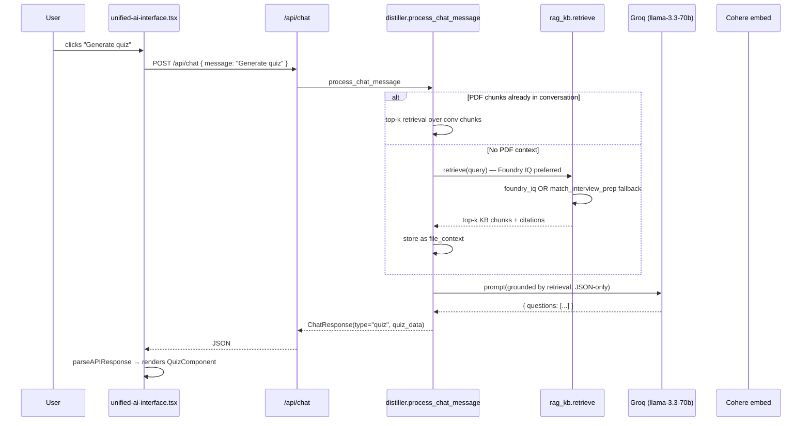
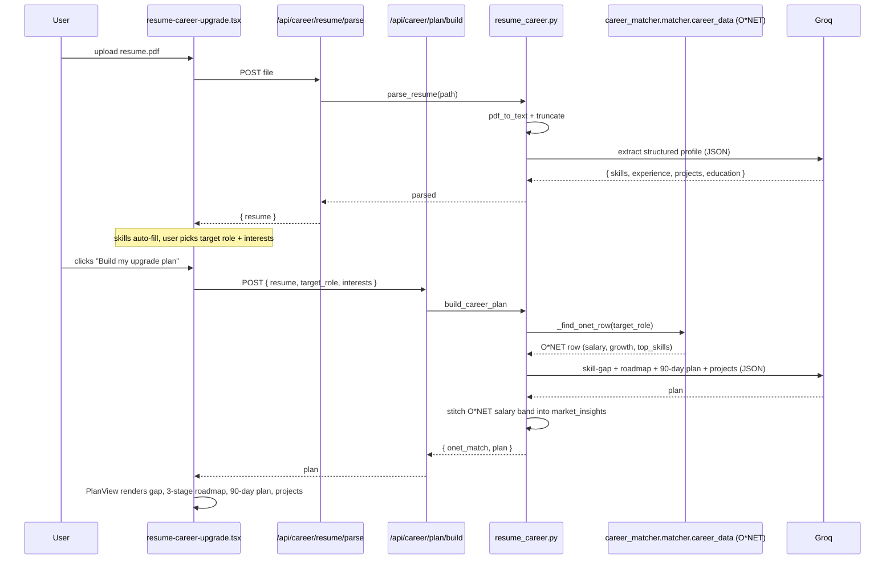
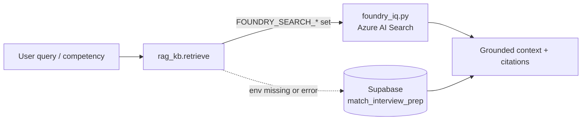
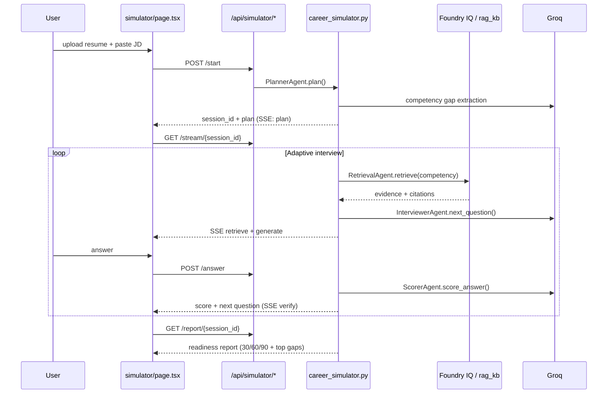

# PathWise — Backend Architecture

This doc is the source of truth for what runs where, what data moves between modules, and how the product surfaces (Learn, Career Simulator, Career, Dashboard) are wired. Read this before adding a new endpoint or model.

**Package layout:** see [STRUCTURE.md](./STRUCTURE.md). **Monorepo overview:** [../../README.md](../../README.md).

---

## 1. System overview

```mermaid
flowchart LR
    subgraph Browser["Browser (Next.js on Vercel)"]
        LP[Learn page]
        SP[Career Simulator]
        CP[Career page]
        DP[Dashboard page]
    end

    subgraph API["FastAPI on Hostinger VPS (main.py)"]
        CHAT["/api/chat<br/>process_chat_message"]
        UPLOAD["/api/chat/upload<br/>process_file_for_chat"]
        SIM["/api/simulator/*<br/>career_simulator"]
        RESUME["/api/career/resume/parse<br/>/api/career/plan/build<br/>/api/career/upgrade<br/>/api/career/plan/snapshot<br/>/api/career/plan/latest/{user_id}"]
        CAREER["/api/career/match<br/>/api/career/roadmap/unified"]
        DASH["/api/dashboard/*"]
        AGENT["/api/agent/mastery<br/>/api/agent/diagnostic/results"]
    end

    subgraph Modules["pathwise/ package"]
        DIST[learn/distiller.py<br/>chunk·embed·LLM·intent]
        RAG[learn/rag_kb.py<br/>retrieve() indirection]
        FIQ[infra/foundry_iq.py<br/>Microsoft Foundry IQ]
        SIMM[career/career_simulator.py<br/>multi-agent loop]
        RES[career/resume_career.py<br/>resume parser + planner]
        CM[career/career_matcher.py<br/>RIASEC + O*NET]
        CPS[career/career_plan_storage.py<br/>plan snapshots]
        DASHM[dashboard/dashboard.py]
        SH[infra/supabase_helper.py]
        MAST[dashboard/mastery.py]
    end

    subgraph External["External services"]
        GROQ[Groq<br/>llama-3.3-70b]
        COH[Cohere<br/>embed-english-light-v3]
        AZ[Microsoft Foundry IQ<br/>Azure AI Search]
        SB[(Supabase Postgres<br/>+ pgvector fallback)]
    end

    LP -->|chat / quick actions| CHAT
    LP -->|PDF upload| UPLOAD
    SP -->|start / answer / stream| SIM
    CP -->|resume parse/build/upgrade| RESUME
    CP -->|matchCareer / roadmap| CAREER
    DP --> DASH
    DP -.->|eval card| SIM

    CHAT --> DIST
    UPLOAD --> DIST
    SIM --> SIMM
    RESUME --> RES
    CAREER --> CM
    RESUME --> CPS
    DASH --> DASHM
    AGENT --> MAST

    DIST --> GROQ
    DIST --> COH
    DIST --> SH
    DIST -.->|when no PDF context| RAG
    SIMM --> RES
    SIMM --> RAG
    SIMM --> DIST
    RES --> GROQ
    RES --> CM
    RAG --> FIQ
    RAG -.->|failover| SB
    FIQ --> AZ
    CM --> COH
    CM --> GROQ
    SH --> SB
    DASHM --> SH
    MAST --> SH
```

Key design choices that follow from this diagram:

- **One generation path for the Learn page.** Every Quick Action button (summary, lesson, quiz, flashcards, workflow, diagnostic) goes through `/api/chat → distiller.process_chat_message`. There is no separate `/api/agent/{kind}` endpoint any more — they were placeholder content and divergent from production prompts.
- **RAG is opt-in by absence of PDF.** When the user has not uploaded a document, `process_chat_message` calls `rag_kb.retrieve()`, which **prefers Microsoft Foundry IQ** (`pathwise/infra/foundry_iq.py` → Azure AI Search) and **falls back** to the `interview_prep_kb` Supabase table. Results are piped in as the same `file_context` that PDF chunks would have populated.
- **Career Simulator is a multi-agent loop.** `pathwise/career/career_simulator.py` orchestrates named agents (Planner, Retrieval, Interviewer, Scorer, Remediation, Report) over resume + JD with SSE streaming for the Agent Thinking panel. It reuses `resume_career.py`, `distiller.py`, and `rag_kb.retrieve()` — no duplicate business logic.
- **Career upgrade is its own pipeline.** Resume parsing → skill-gap → plan generation lives in `resume_career.py` so the career page does not depend on the chat machinery and a future migration (e.g. switching to a fine-tuned skill-gap model) only changes one file.
- **Mastery is the only persisted user-progress signal we trust.** Diagnostic submissions write to `mastery.py → supabase_helper`; the dashboard reads from there.

---

## 2. Learn page — request flow



Everything the user sees on the Learn page comes out of one of these handlers in `distiller.py`:

| Intent           | Handler                          | Output type      | Frontend renderer      |
| ---------------- | -------------------------------- | ---------------- | ---------------------- |
| summary          | `_handle_summary_generation`     | `summary`        | `SummaryComponent`     |
| lesson           | `_handle_lesson_generation`      | `lesson`         | `LessonComponent`      |
| quiz             | `_handle_quiz_generation`        | `quiz`           | `QuizComponent`        |
| flashcards       | `_handle_flashcard_generation`   | `flashcards`     | `FlashcardsComponent`  |
| workflow         | `_handle_workflow_generation`    | `workflow`       | `WorkflowComponent`    |
| diagnostic       | `_handle_diagnostic_generation`  | `diagnostic`     | `DiagnosticComponent`  |
| anything else    | `_handle_regular_chat`           | `text`           | plain text bubble      |

The intent dispatcher is purely keyword-based at the top of `process_chat_message` — small, debuggable, and fast.

---

## 3. Career page — resume → upgrade plan



Why a single `build_career_plan` LLM call instead of three sequential ones:

- One Groq round trip is ~3× cheaper than three.
- The model produces more coherent output when it sees the gap analysis and the plan it's writing for in the same context window.
- Failure modes are easier to reason about — we only need to validate one JSON.

The `_find_onet_row` lookup uses three fallbacks (exact title → substring → word-overlap score) so even unusual target roles (e.g. "MLOps Engineer", which isn't in O*NET verbatim) still anchor to a credible row instead of returning nothing.

---

## 4. RAG: how embeddings actually work in Supabase

```mermaid
flowchart TB
    subgraph IngestTime["Ingest time (one-shot CLI)"]
        MD[interview_prep/*.md]
        CK[chunk_markdown<br/>1800 char windows<br/>250 char overlap]
        EMB1[Cohere embed-english-light-v3<br/>384-dim]
        UP[supabase upsert<br/>on chunk_hash]
        TBL[(interview_prep_kb<br/>id · doc · section · chunk · embedding vector(384))]
        IDX[ivfflat index<br/>vector_cosine_ops]
        MD --> CK --> EMB1 --> UP --> TBL
        TBL --> IDX
    end

    subgraph QueryTime["Query time (every chat without a PDF)"]
        Q[user message]
        EMB2[Cohere embed query]
        RPC[match_interview_prep RPC<br/>1 - cosine_distance]
        TOP[top-6 chunks]
        Q --> EMB2 --> RPC --> TOP
        IDX -. ANN search .-> RPC
    end

    TOP --> CTX[file_context for LLM prompt]
```

### Supabase schema

```sql
create extension if not exists vector;

create table interview_prep_kb (
  id            bigserial primary key,
  doc           text not null,
  section       text,
  chunk         text not null,
  chunk_hash    text not null unique,
  embedding     vector(384),
  created_at    timestamptz default now()
);

create index interview_prep_kb_embedding_idx
  on interview_prep_kb using ivfflat (embedding vector_cosine_ops)
  with (lists = 100);

create or replace function match_interview_prep(
  query_embedding vector(384),
  match_count int default 6
)
returns table (id bigint, doc text, section text, chunk text, similarity float)
language sql stable
as $$
  select id, doc, section, chunk,
         1 - (embedding <=> query_embedding) as similarity
  from interview_prep_kb
  where embedding is not null
  order by embedding <=> query_embedding
  limit match_count;
$$;
```

The full migration is in `backend/migrations/20260506_interview_prep_kb.sql`.

### Why these specific choices

- **`vector(384)`** because Cohere `embed-english-light-v3.0` produces 384-dim vectors. We deliberately use the same model `distiller.py` already uses so query embeddings are interchangeable between PDF chunks and the KB.
- **`chunk_hash` UNIQUE** makes ingestion idempotent. Re-running `python -m rag_kb ingest …` after editing one markdown file only re-embeds the changed chunks.
- **IVFFlat with `lists=100`** is the right setting for a few-thousand-row table. If the corpus grows past ~50k chunks, switch to `hnsw` (also supported by pgvector) without changing the rest of the stack.
- **Server-side RPC `match_interview_prep`** does the cosine search inside Postgres so the backend only ships back the top-k. Falling back to a client-side cosine scan is implemented in `rag_kb.retrieve_kb` for the case where the RPC isn't installed.

### One-time setup

```bash
# 1. Apply the migration in Supabase Studio
#    https://supabase.com/dashboard/project/<ref>/sql
#    Paste backend/migrations/20260506_interview_prep_kb.sql → Run

# 2. Run the end-to-end smoke test (verifies env, Cohere, table, ingest, retrieval)
cd backend
python -m scripts.test_rag                # full run
python -m scripts.test_rag --skip-ingest  # dry-run, useful in CI

# 3. Or use the stand-alone CLI
python -m pathwise.learn.rag_kb ingest knowledge_base
python -m pathwise.learn.rag_kb probe "what is rag"
```

If the table is missing, `scripts/test_rag.py` prints the SQL inline and a direct link to the SQL editor for your project so you can copy-paste in <30 seconds.

---

## 4b. Microsoft Foundry IQ — hybrid retrieval layer

PathWise satisfies the **Microsoft IQ requirement** for the Creative Apps track by routing grounded retrieval through **Foundry IQ** (Azure AI Search knowledge base) while keeping Supabase pgvector as a transparent failover.



**Corpus sources** (see `backend/knowledge_base/README.md`):

- `knowledge_base/learning/` — technical interview prep topics
- `knowledge_base/behavioral/` — STAR / behavioral guidance
- `knowledge_base/onet_careers/` — 271 O*NET career briefs
- `knowledge_base/projects/` — portfolio project deep-dives (incl. PathWise P08)

**Push to Foundry:**

```bash
cd backend
python scripts/push_to_foundry.py --source knowledge_base --create-index
python scripts/foundry_diag.py   # smoke test query
```

**Env vars** (set in `backend.env` on Hostinger — never commit secrets):

```
FOUNDRY_SEARCH_ENDPOINT=https://<your-search>.search.windows.net
FOUNDRY_SEARCH_KEY=...
FOUNDRY_INDEX=prepkb-index
FOUNDRY_SEMANTIC_CONFIG=...   # optional semantic reranker
```

When Foundry is unavailable, `rag_kb.retrieve()` logs a warning and uses the existing Supabase RPC — the demo keeps running.

---

## 4c. Career Simulator — multi-agent loop

The signature competition feature chains resume parsing, Foundry-grounded retrieval, adaptive interview, and gap remediation into one inspectable story.



| Agent | Module delegate | UI event |
|---|---|---|
| Planner | `resume_career.parse_resume`, `_find_onet_row` | "Here's what I'll test you on" |
| Retrieval | `rag_kb.retrieve` → Foundry IQ | Citation chips |
| Interviewer | Groq via `distiller.call_groq` | Adaptive question (difficulty ∝ prior score) |
| Scorer | Groq judge prompt | Score bar + supported/unsupported |
| Remediation | `distiller.gen_flashcards_quiz`, `map_reduce_summary` | Micro-lesson handoff → `/learn?topic=` |
| Report | `resume_career.build_career_plan` | Readiness Report card |

Offline reliability proof: `python -m pathwise.eval.eval_simulator` → `data/eval/simulator_eval_report.json` → `GET /api/simulator/eval`.

Debug retrieval provider at runtime:

| Method | Path / command |
|---|---|
| Status | `GET /api/rag/status` |
| Live probe | `GET /api/rag/probe?q=...` |
| CLI | `python -m pathwise.learn.rag_kb probe "..."` |

---

## 5. Module reference

| File                       | Role                                                                                                                          |
| -------------------------- | ----------------------------------------------------------------------------------------------------------------------------- |
| `pathwise/learn/distiller.py` | PDF processing, chunking, Cohere embedding, Groq LLM calls, intent dispatcher, all `_handle_*_generation` handlers. |
| `pathwise/learn/rag_kb.py`  | KB ingest + **`retrieve()`** indirection (Foundry IQ preferred, Supabase fallback). CLI: `python -m pathwise.learn.rag_kb ingest|probe|query …`. |
| `pathwise/infra/foundry_iq.py` | **Microsoft Foundry IQ** client — Azure AI Search queries returning citation-shaped chunks. |
| `pathwise/career/career_simulator.py` | **Career Simulator** multi-agent orchestrator, in-memory sessions, SSE event bus. |
| `pathwise/eval/eval_simulator.py` | Offline golden-set eval → groundedness, refusal correctness, p95 latency. |
| `pathwise/career/resume_career.py` | Resume PDF parsing, O*NET row lookup, single-shot LLM plan generation. |
| `pathwise/career/career_plan_storage.py` | Local JSON persistence for latest resume-driven plan snapshots (`data/career_plans/{user}.json`). |
| `pathwise/career/career_matcher.py` | RIASEC quiz scoring + Cohere-embedding based career similarity over O*NET CSV. |
| `pathwise/career/unified_career_system.py` | Older roadmap generator kept for the existing `/api/career/roadmap/unified` endpoint. |
| `pathwise/dashboard/dashboard.py` | Read-side aggregations for the dashboard page (progress, achievements, recommendations). |
| `pathwise/dashboard/mastery.py` | Per-user / per-topic mastery scores. Updated from diagnostic submissions; read by dashboard. |
| `pathwise/infra/supabase_helper.py` | Thin wrapper around `supabase-py` with graceful fallbacks when env is missing. |
| `migrations/`              | SQL DDL for every Supabase change. Apply manually in Supabase Studio (we do not run migrations from app code).                |

---

## 6. Endpoint surface (live)

Only endpoints currently called by the frontend or used operationally are listed. Anything previously documented but removed is intentionally absent.

### RAG / Foundry observability

| Method | Path                                  | Notes                                                                |
| ------ | ------------------------------------- | -------------------------------------------------------------------- |
| GET    | `/api/rag/status`                     | Last provider, Foundry DNS check, fix hints.                         |
| GET    | `/api/rag/probe?q=...`                | Live retrieval probe with `retrieval_provider` per chunk.            |

### Learn

| Method | Path                                  | Notes                                                                |
| ------ | ------------------------------------- | -------------------------------------------------------------------- |
| POST   | `/api/distill`                        | Distill a PDF into a stored lesson (Supabase row + cards).            |
| POST   | `/api/chat`                           | Chat / quick action dispatcher. Single source of truth for content. |
| POST   | `/api/chat/upload`                    | Upload a PDF and seed the conversation context.                      |
| POST   | `/api/chat/ingest-distilled`          | Reuse a previously-distilled lesson in a new conversation.           |
| GET    | `/api/chat/conversations/{user_id}`   | Conversation list.                                                  |
| GET    | `/api/chat/conversation/{conv_id}`    | One conversation's history.                                          |
| GET    | `/api/chat/side-menu/{user_id}`       | Recent PDFs + preferences for the side menu.                         |
| PUT    | `/api/chat/preferences/*`             | Explanation level, framework preference.                             |

### Career

| Method | Path                                 | Notes                                                                                  |
| ------ | ------------------------------------ | -------------------------------------------------------------------------------------- |
| POST   | `/api/career/resume/parse`           | NEW. Resume PDF → structured profile.                                                  |
| POST   | `/api/career/plan/build`             | NEW. Parsed resume + target role + interests → gap + roadmap + 90-day plan.            |
| POST   | `/api/career/plan/snapshot`          | Save latest generated plan snapshot for a user.                                         |
| GET    | `/api/career/plan/latest/{user_id}`  | Fetch latest saved plan snapshot for dashboard/career restore.                          |
| POST   | `/api/career/upgrade`                | NEW. One-shot helper that combines the two above.                                      |
| POST   | `/api/career/match`                  | RIASEC quiz → top career matches.                                                      |
| GET    | `/api/career/quiz`                   | The 10 quiz questions.                                                                 |
| POST   | `/api/career/roadmap/unified`        | Existing roadmap generator (used by the manual flow).                                  |
| (others …)                          |                                       | Older interview / advice / planning endpoints — still wired, see `main.py`.            |

### Mastery / Diagnostic

| Method | Path                                  | Notes                                                                |
| ------ | ------------------------------------- | -------------------------------------------------------------------- |
| GET    | `/api/agent/mastery/{user_id}`        | Per-topic mastery for the dashboard.                                 |
| POST   | `/api/agent/diagnostic/results`       | Submit answers → score, weak areas, mastery update.                  |

### Career Simulator

| Method | Path                                  | Notes                                                                |
| ------ | ------------------------------------- | -------------------------------------------------------------------- |
| POST   | `/api/simulator/start`                | Multipart resume + JD → `session_id` + competency plan.              |
| POST   | `/api/simulator/answer`               | Score answer; adaptive next question; optional remediation.          |
| GET    | `/api/simulator/stream/{session_id}`  | **SSE** — Agent Thinking timeline (plan / retrieve / verify).        |
| GET    | `/api/simulator/report/{session_id}`  | Readiness report — gaps, 30/60/90 plan, citations.                   |
| GET    | `/api/simulator/eval`                 | Latest offline eval metrics for dashboard eval card.                   |

### Dashboard

| Method | Path                                            |
| ------ | ----------------------------------------------- |
| GET    | `/api/dashboard/progress/{user_id}`             |
| GET    | `/api/dashboard/analytics/{user_id}`            |
| GET    | `/api/dashboard/achievements/{user_id}`         |
| POST   | `/api/dashboard/recommendations`                |
| POST   | `/api/dashboard/coaching`                       |

---

## 7. Environment

```
GROQ_API_KEY=…                       # Llama-3.3-70b inference (used in distiller, resume_career, simulator)
COHERE_API_KEY=…                     # embed-english-light-v3 (PDF chunks + KB + career embeddings)
NEXT_PUBLIC_SUPABASE_URL=…           # used by both frontend and backend
NEXT_PUBLIC_SUPABASE_ANON_KEY=…      # row-level-secured public key

# Microsoft Foundry IQ (Creative Apps — citation-backed grounding)
FOUNDRY_SEARCH_ENDPOINT=…            # https://<search>.search.windows.net
FOUNDRY_SEARCH_KEY=…                 # admin/query key (or omit for DefaultAzureCredential)
FOUNDRY_INDEX=prepkb-index           # Azure AI Search index name
FOUNDRY_SEMANTIC_CONFIG=…            # optional semantic reranker config name

# Optional:
SUPABASE_SERVICE_ROLE_KEY=…          # if RLS prevents the anon key from upserting into interview_prep_kb
CORS_ORIGINS=…                       # extra frontend origins (comma-separated)
```

If you maintain a second Supabase project specifically for the RAG KB, point the backend at it via `NEXT_PUBLIC_SUPABASE_URL` / `NEXT_PUBLIC_SUPABASE_ANON_KEY` before running the ingest CLI. The lessons / cards / users tables can stay in either project — `supabase_helper.py` reads the same env vars.

---

## 8. Operational checklist

When adding a new content type for the Learn page:

1. Add a `_handle_<kind>_generation` in `distiller.py`.
2. Wire it into the intent dispatcher near the top of `process_chat_message`.
3. The handler MUST set `type` in its return payload, and put the structured payload under a `<kind>_data` key (mirroring the existing handlers).
4. On the frontend, extend `parseAPIResponse` in `unified-ai-interface.tsx` and add a `<kind>Component` to render it.
5. Do **not** add a new `/api/agent/<kind>` route — we deleted those for a reason.

When changing the RAG corpus:

1. Drop new markdown into `interview_prep/`.
2. Re-run `python -m pathwise.learn.rag_kb ingest knowledge_base`. Idempotency comes from `chunk_hash`.
3. Spot-check with `python -m pathwise.learn.rag_kb probe "<question>"`.

When touching resume-driven plan persistence:

1. `POST /api/career/plan/snapshot` writes the latest plan JSON per user.
2. `GET /api/career/plan/latest/{user_id}` is the read path used by dashboard.
3. `POST /api/career/upgrade` can persist automatically when `user_id` query param is provided.

When changing the embedding model:

1. Update `cohere_embed` in `distiller.py`.
2. Update `vector(N)` in `migrations/…interview_prep_kb.sql`, and re-create the table (drop + migrate).
3. Re-ingest the entire corpus — old vectors are not comparable to new ones.
